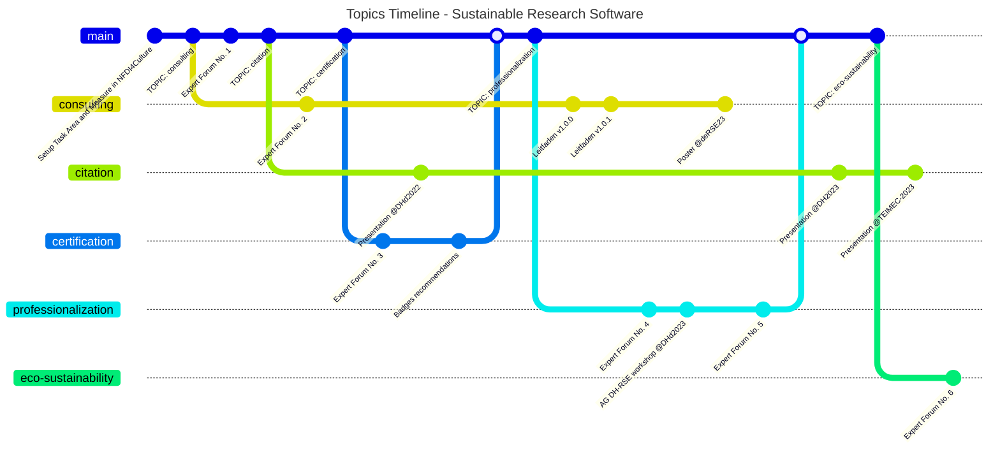

```mermaid
---
title: Topics Timeline - Sustainable Research Software
---
gitGraph
   commit id: "Setup Task Area and Measure in NFDI4Culture"
   commit id: "TOPIC: consulting"
   branch consulting
   checkout main
   commit id: "Expert Forum No. 1"
   commit id: "TOPIC: citation"
   branch citation
   checkout main
   checkout consulting
   commit id: "Expert Forum No. 2"
   checkout main
   commit id: "TOPIC: certification"
   branch certification
   checkout certification
   commit id: "Expert Forum No. 3"
   checkout citation
   commit id: "Presentation @DHd2022"
   checkout certification
   commit id: "Badges recommendations"
   checkout main
   merge certification
   checkout main
   commit id: "TOPIC: professionalization"
   branch professionalization
   checkout consulting
   commit id: "Leitfaden v1.0.0"
   commit id: "Leitfaden v1.0.1"
   checkout professionalization
   commit id: "Expert Forum No. 4"
   commit id: "AG DH-RSE workshop @DHd2023"
   checkout consulting
   commit id: "Poster @deRSE23"
   checkout professionalization
   commit id: "Expert Forum No. 5"
   checkout main
   merge professionalization
   checkout citation
   commit id: "Presentation @DH2023"
   checkout main
   commit id: "TOPIC: eco-sustainability"
   branch eco-sustainability
   checkout citation
   commit id: "Presentation @TEIMEC-2023"
   checkout eco-sustainability
   commit id: "Expert Forum No. 6"
```
